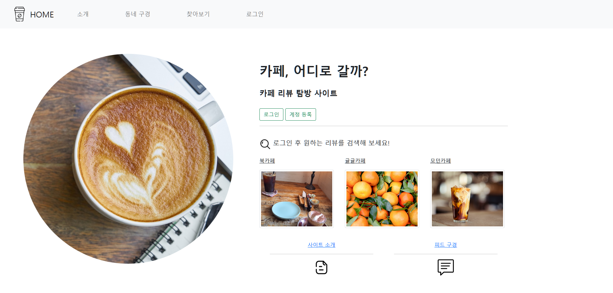

# ☕ 카페, 어디로 갈까?

## 주제

'웹 프로그래밍' 강의에서 Springboot 프레임워크를 통해 진행한 실습입니다. 카페의 리뷰를 작성하고 공유할 수 있는 사이트를 기획하고 작성했습니다.

아래 서적의 코드를 변경하고 활용했습니다.

> 서적 : 백견불여일타 스프링 부트 쇼핑몰 프로젝트 with JPA

## 기술 스택

<h4>개발</h4>
 

<h4>데이터베이스</h4>

<h4>빌드 도구</h4>

## 기능 소개

#### 메인 페이지

- 리뷰 랜덤 조회

#### 회원 기능

- 회원가입, 로그인
- 로그인 유저만 접근 가능한 페이지 설정
- 로그인 유저 정보 확인 (마이페이지)
- 비밀번호 변경
- Spring Security

#### 리뷰 목록 조회

- 카페 리뷰 업로드
- 리뷰 조회
  - 검색 조회
  - 가입할 때 입력받은 지역 기반 조회
  - 상세 조회

#### 상세 페이지

- 리뷰 수정, 삭제 (Soft delete)
- 작성자에게만 노출되는 수정/삭제 버튼

#### 북마크

- 북마크 추가
- 유저가 북마크한 목록 조회
- 북마크 삭제

#### 권한 기능

- 유저의 리뷰 삭제 가능, 잘못 삭제된 게시글 복구

##

#### 데이터베이스 접근

- JSP의 쿼리 메소드, querydsl 활용

#### MVC 패턴 적용

#### 테스트 코드

- Service의 단위 테스트로 비즈니스 로직의 동작을 확인

 

> '웹 프로그래밍' 강의에서 과제로 작성하였던 코드를 전체적으로 리팩토링하여 새로 커밋했습니다.
